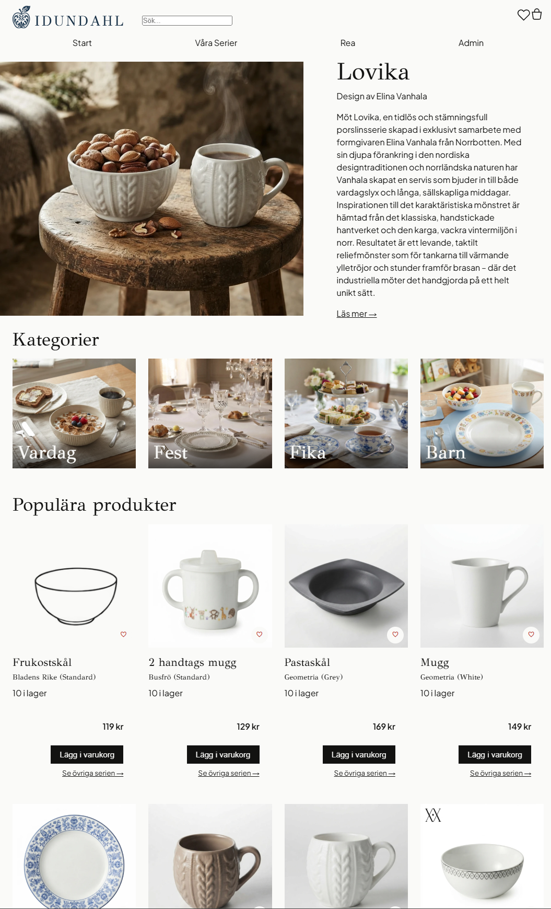
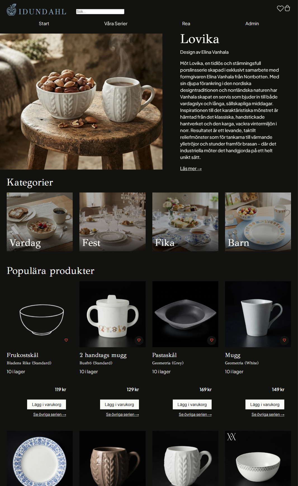

# Idundahl

En e-handelssajt för ett fiktivt porslinsföretag, byggd med Angular, Express och Supabase. Projektet började som ett skolprojekt i kursen JavaScript 3, men jag byggde det bredare än uppgiften krävde för att förstå hela kedjan från databas till gränssnitt.

Desktop i darkmode och lightmode: 
<p>
  
  
</p>

---

## Tech stack

- **Angular 22 + TypeScript** för frontend, med signals och Signal Forms
- **Express + TypeScript** som API-lager mellan Angular och databasen
- **Supabase (Postgres)** för databas och bildlagring

Supabase erbjuder färdiga lösningar för att prata direkt med databasen från frontend, men jag valde att ändå gå via ett eget Express-lager. Jag ville ha insyn i hela flödet, inte bara frontend-delen, och förstå hur datan faktiskt hänger ihop innan den når gränssnittet.

---

## Funktioner

- Startsida med hero, kategorispots och rekommenderade produkter
- Sök på produktnamn
- Produktsidor med bildgalleri och bläddringsbar karusell med liknande produkter
- "Nyhet"-bricka på produkter publicerade de senaste sju dagarna
- Seriesidor, kategorisidor och en översikt över alla serier
- Varukorg med redigerbart antal, sparad i `localStorage`
- Kassasida med kunduppgifter (utan riktig betalning)
- Admin: produktlista filtrerbar per serie, och formulär för nya produkter
- Ljust och mörkt läge som följer systeminställningen
- Fluid layout som skalar mellan mobil och desktop utan fasta brytpunkter

---

## Designval

**Normaliserad databas.** Produkterna ligger inte i en platt tabell, utan är uppdelade i kategori, serie, variant, produkttyp och produkt. Det speglar hur en porslinsserie faktiskt är uppbyggd: en serie har flera varianter (färger), och varje variant har flera produkter. Priset är ett mer omfattande admin-formulär, där man väljer serie, variant och produkttyp, men i gengäld blir datan konsekvent och lätt att bygga navigering kring.

**SKU genereras av servern.** Admin skriver aldrig en SKU själv. Servern bygger den automatiskt från serie, produkttyp, variant och storlek, så det finns ingen risk för felstavning eller inkonsekventa format.

**Skydd mot misstag i admin.** Genomgående har jag försökt låta systemet ta hand om det som är lätt att göra fel. Några exempel:
- Produkttyp-listan i formuläret visar bara typer som hör till vald serie, och servern validerar dessutom kopplingen en gång till.
- Om ett mått anges måste också en storleksetikett anges. Saknas både mått och etikett sätter servern "Lagom".
- Publiceringsdatum kan sättas fritt, men väljer man dagens datum måste man bocka i en bekräftelse. Det ska vara svårt att publicera något för tidigt av misstag.

**Intrinsic design i stället för brytpunkter.** Layouten bygger på `clamp()`, container queries och uträknade grid-formler i stället för tre fasta brytpunkter. Den skalar mjukt mellan storlekarna, och en bieffekt jag inte planerat för var att liggande läge på mobil fungerade direkt utan extra anpassning.

---

## Tekniska lösningar jag vill lyfta fram

**Signal Forms.** Admin-formuläret är byggt med Angulars nya Signal Forms. En lurig detalj var att ett tomt sifferfält rapporterar `0` snarare än "tomt". För att pris och lagersaldo inte ska kunna skickas tomma behandlar valideringen därför `0` som ett ej ifyllt värde. Bieffekten är att en produkt inte kan läggas till med lagersaldo `0`, något jag medvetet accepterade för att prioritera annat.

**`switchMap` som medvetet undantag från signals.** I admin-formuläret beror fälten på varandra: väljer man en serie hämtas den seriens produkttyper med ett nytt anrop. Här använde jag RxJS `switchMap` tillsammans med `toObservable`/`toSignal`, eftersom det automatiskt avbryter ett pågående anrop om användaren hinner byta val innan svaret kommit. Jag hittade ingen lika enkel inbyggd motsvarighet inom signals.

**Temaanpassade bilder med fallback i flera steg** ([`themed-image.ts`](client/src/app/components/themed-image/themed-image.ts)). Bilderna finns i en ljus basversion och en valfri `_dark`-version. Databasen lagrar bara bas-URL:en, och komponenten avgör i webbläsaren om en mörk version finns genom bildens `error`-event. Saknas den mörka används den ljusa, och saknas bilden helt visas en platshållare. Mitt första förslag var att namnge båda versionerna (`_light`/`_dark`), men att låta basfilen vara standard och `_dark` en valfri override visade sig vara enklare och fungerar för alla bilder på sajten, även de som aldrig får en mörk version.

**Platshållarbilder grupperade efter form.** Många produkter saknar ännu riktiga foton. I stället för en platshållare per produkttyp (41 st) grupperade jag typerna efter grundform, eftersom till exempel en assiett och en mattallrik ser i princip likadana ut. Det blev 19 bilder i stället för 41.

---

## Arbetssätt

Jag har använt AI som bollplank genom hela projektet, men med målet att förstå varje lösning innan den hamnade i koden. Flera av de bättre lösningarna kom av att jag ifrågasatte det första förslaget, som bildnamngivningen ovan. Beslut och felsökning har jag dokumenterat löpande i separata loggar, vilket gjorde det lättare att hålla fast vid tidigare val och att hitta tillbaka när samma typ av fel dök upp igen.

---

## Lärdomar

- **Välj material efter verktygens begränsningar.** Produktbilderna är AI-genererade, och porslin visade sig svårt att få konsekvent. Jag bytte riktning flera gånger (SVG till WebP, enskilda produktbilder till sammansatta bilder per variant) innan jag landade. Nästa gång skulle jag välja en produkt som är enklare att avbilda, men jag lärde mig mycket av att planera om efter hand.
- **Kontrollera att ändringen faktiskt ligger i filen.** Flera gånger kändes kod klar i huvudet men hade aldrig sparats på rätt ställe, vilket gav samma typ av fel om och om igen. Att alltid dubbelkolla är en vana jag tar med mig.

---

## Kända begränsningar

- De flesta av de 132 produkterna saknar riktiga foton och visar en formbaserad platshållare. Serien Geometria har fullständiga produktbilder i två varianter.
- Produktbeskrivningar som saknades är just nu lorem ipsum.
- Variantbyte på seriesidan visar alltid huvudvarianten.
- Admin-endpoints är öppna utan inloggning.
- Bilderna saknar ännu alt-text.
- En ny produkt kan inte läggas till med lagersaldo `0`, eftersom formuläret tolkar `0` som ett tomt fält.

---

## Vidareutveckling i mån av tid

Utanför skolarbetet vill jag fortsätta utveckla projektet. Det jag prioriterar:

- **Funktionalitet:** variantbyte på seriesidan utan omladdning, admin-inloggning, ett riktigt orderflöde med orderbekräftelse, och "gillade" produkter sparade i `localStorage`
- **Tillgänglighet och tema:** alt-text på alla bilder, och en knapp för att växla mellan ljust och mörkt läge manuellt
- **Innehåll:** riktiga produktbeskrivningar, stämningsbilder och beskrivningar för fler serier, fler produktbilder, och en hero-bild vars beskärning fungerar lika bra i liggande mobilläge

---

## Kom igång

Projektet består av två delar som körs i varsin terminal.

**Server:**

```bash
cd server
npm install
npm run dev
```

Körs på `http://localhost:8000`. Servern behöver en `.env`-fil med Supabase-uppgifter (ingår inte i repot):

```
PORT=8000
SUPABASE_URL=...
SUPABASE_SERVICE_KEY=...
```

**Client:**

```bash
cd client
npm install
npm start
```

Körs på `http://localhost:4200` och når servern via en proxy (`proxy.config.json`), så ingen CORS-konfiguration behövs.
